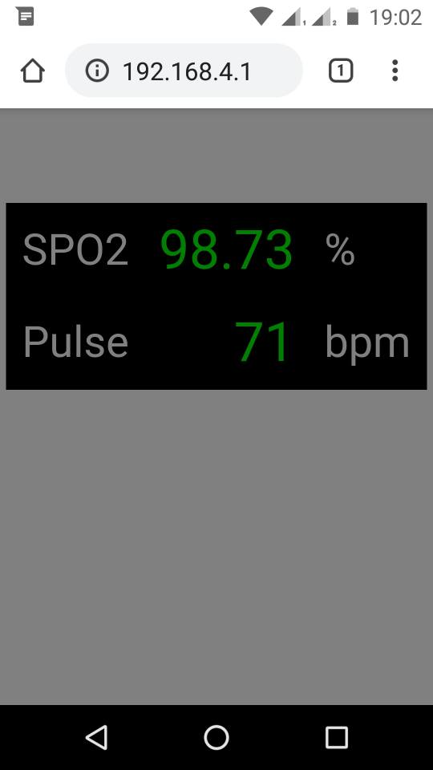

# ESP8266_MAX30102_SPO2_PULSE_METER

ESP8266 SPO2 and Pulse meter using MAX30102 sensor. The ESP8266 acts as a WiFi Access Point and web page server. 
SPO2 and heart rate measurements are displayed on a browser and updated every 4 seconds.

## Development Environment

* Wemos D1 Mini board
* Arduino 1.8.12 on Ubuntu 20.04 amdx64

## Credits

This is a mashup of code from the following projects :

* MAX30102 sensor initialization and FIFO readout code from 
[Sparkfun](https://github.com/sparkfun/SparkFun_MAX3010x_Sensor_Library)

* SPO2 & pulse rate analysis code by  Robert Fraczkiewicz from 
[aromring's repository](https://github.com/aromring/MAX30102_by_RF). I tweaked RF's implementation to use 50Hz sample rate. 

* ESP8266 AP & Webpage server code from [Random Nerd tutorials](https://randomnerdtutorials.com/esp8266-nodemcu-access-point-ap-web-server/)

## Usage
* Connect to the WiFi Access Point SPO2-Pulse. There is no password, but you can define one if you like.
* Open the url 192.168.4.1 in your web browser
* A new measurement is displayed every 4 seconds
* If the measurement fails (finger not present, disturbed while reading), the value will display as 0
* If unable to detect the MAX30102 sensor on power-up, the board built-in LED will blink rapidly. Try cycling power to the board.
* In normal operation, the board built-in LED will toggle every 4-second measurement cycle

